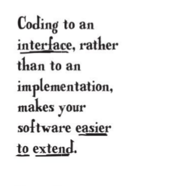
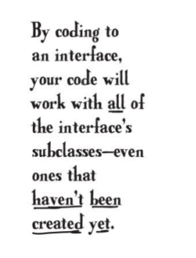
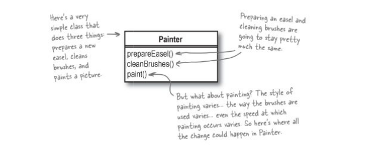
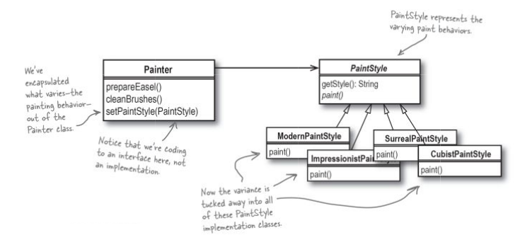

## INTERFACE
> An Class which does `not` contain an `implementation`. It's methods have no definition(implementaion). Classes implementing it, should adhere to its signatures(rules/methods).

 

### Anytime you have behavior in an application that you think is likely to change 
Move  the behavior away from parts of your application that probably won't chagne frequently.
In other words, you should always try to `encapsulate what varies`.

#### `Example`

It looks like `Painter` has two methods that are pretty stable, but that `paint()` method is going to vary a lot in its implementation. So let's encapsulate what varies, and move the implementation of how a painter out of the `Painter` class.

### OO Principles learned
    1) Encapsulate what varies.
    2) Code to an interface rather than to an implementation.
    3) Each class in your application should have only one reason to change.
