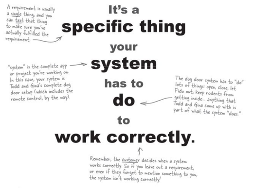
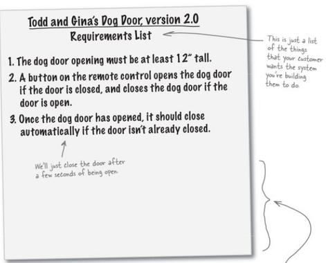
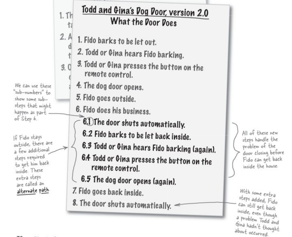

# DOG DOOR APP

*Making a system*
> Most important to make sure the software does what the customer wants it to do.

## **Dog Door System**
    1) Gather requiements for dogdoor
    2) Figure out what the door should really do
    3) Gather any additional info, we need from Todd & gina

## *What is a Requirement ?*
 

### *To gather requirements*
>listen to customer, let the customer talk

### Requirement List

## *What the Door should really do (Use Case)* ?

## Use Case
    1) A Use Case is all about a What. It does not care about a How.
    2) steps a system takes to make something happen.
    3) A Single Use Case represents a single task or goal.

## A Use Case contains 3 parts
    1) Clear Value to the System
        A Use Case helps to achieve a goal.
    2) Start & Stop 
        A Use Case has a definite starting & stopping point.
    3) External Initiator
        A User or another system starts or initiates a use case.

## UseCase vs UseCase Diagram
> Use Case diagram shows many usecases visually        

___

step1 -> step2 (After making use case)