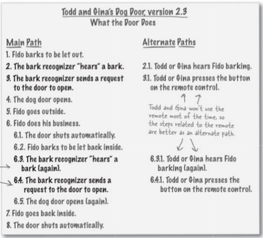
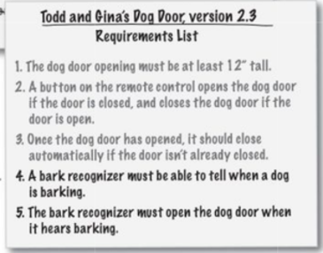

## One Constant in software that will be always there
## - `CHANGE`
    Requirements change all the time

>Todd and Gina have come up with an idea.
They want their dog door to change.    
They want it to become automatic.
The door should open automatically on their dog's bark most of the time.

# Modified Use Case

>There are 7 ways this Use Case can be completed with combination of the main and several alternate paths.

# Modified Requirements List

> Whenever Use case changes, it might indicate that requirements list changes

> Change is constant and your system should always improve every time you work on it.