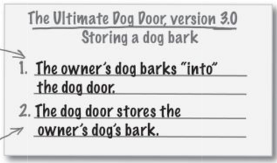

# New problem occured with DogDoor System
The new bark recognizer recognizes bark of all dogs and open the door instead of recognising the owner dog's bark.

# Use Case after Updating

# A New Use Case (Storing owner's dog bark)

# The power of loosely coupled applications
Loosely coupled Modules of a system are independent of each other. In other words, changes to one object don't require you to make a bunch of changes to other objects.

> Delegation `shields` your modules/objects from implementation changes to `other modules/objects` in software

# Pay attention to the nouns in your use case
The `nouns` in the use case are usually the classes/objects in the system.

Not all are needed as classes in the system. The `Dog` object is `actor`, external to the system.
As wellas the owner, inside, outside are not needed in the system as classes.
The button also not needed as it is included in the `remote` object.

> The nouns in the use case are a good starting point for figuring out what classes you might need in your system.

> The verbs are (usually) the methods of the objects in your system.

# UML

    A knows about B but B does not know about A.
    A is dependent on B somehow.

> The `door` is an attribute in both Remote and BarkRecognizer.  
Here Remote class has a reference to the DogDoor class. Similarly BarkRecognizer also has a reference to DogDoor class.
Both Remote and BarkRecognizer are dependent on DogDoor class.