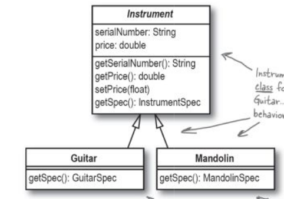
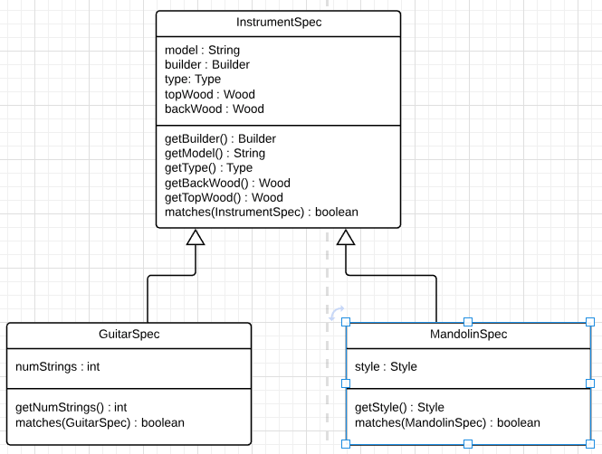
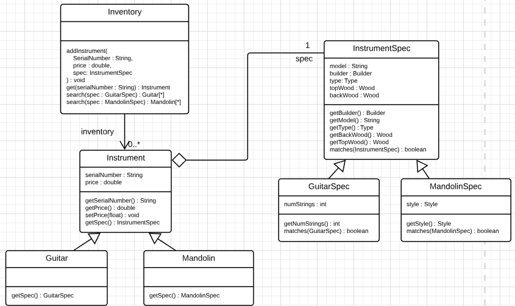
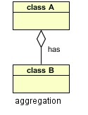

# Rick's Guitars app(chapter1) changes 

> The owner want to add `Mandolins` with his guitars.
Mandolin is similiar to guitar but not the same.

## UML Changes

### `Adding Mandolin`

Here guitar and mandolin has some common attributes and methods which are  in a single class(`abstract class`).

`Mandolin` can come in `several styles` like an "A" style or "F" style mandolin.

These classes also need their respective spec classes.

### `Adding Instrument spec class`

### `Abstract class`

>The abstract class defines behavior, and the subclasses implement that behavior.

Instrument and InstrumentSpec are abstract class.

An abstract class can't create an instace of it.

Guitar, Mandolin, GuitarSpec, MandolinSpec are child classes(subclass) that inherits the abstract class(baseclass) named Instrument, InstrumentSpec.

### `Final UML`

#### `Aggregation`

special form of association and means that one thing is part of another thing.

Here Instrument is partly made up of of InstrumentSpec.
Instrument has `spec` attribute.

### Well Designed software
   If software is hard to change on new reruirements
   if change to a module requires changes in other modules.
   If software breaks(stops working) on a change 
   
   `The design is not good`

   `One of the best ways to see if software is well-designed is to try and CHANGE it.`
   `Great software is easy to change and extend.`