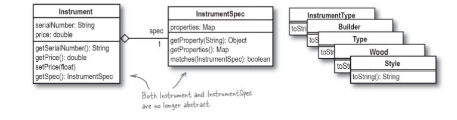
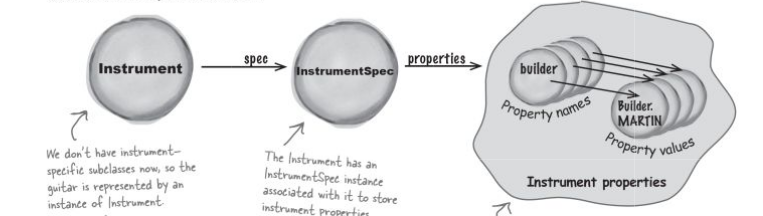
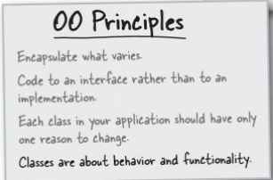

## Problem with Ricks app
    1) Whenever new type of instrument like manjo, drum is added. There are various other changes are needed in other modules. Which is not good.
    Like we have to add respective search() method for new instrument. addInstrument() also needs to be changed.
    These problems are occuring because we have coded to implementations rather than interface.
    2) For every new Instrument subclass added we have to add respective InstrumentSpec subclass also.
    The instrument subclasses do not contain varying methods or behaviour. They have only varying spec object.

## Coding to Interface rather than implementation
`search()` in Inventory

There are seperate search() method for different instrument implementation.
Making a single search() to work with different instruments by coding it to an interface/abstraction.
The search is made to work with InstrumentSpec.
InstrumentSpec is no longer abstract.

## Removing all the Instrument implementations
As the Instrument subclasses does not differ in behavior. They have only varying properties encapsulated in InstrumentSpec.
Also here in the app, the subclasses have no property and methods of their own. Only constructor with different InstrumentSpec.
So the Instrument implementations or the subclasses can be eliminated.
Instrument is no longer abstract in the app.
`Different types of instrument can created using Instrument class only`.

## Subclass when behaviour changes.
No need to subclass when their is no change in behaviour.
Here various instruments like mandolin and guitar behaviour is not changing, only their properties(InstrumentSpec) changes. Behaviour is same for all instruments.

`Classes are about behaviour`

## Code once look twice(or more)
Keep looking over your designs when you run into problems. A decision you made earlier may be what's causing you headaches now.

`Design is iterative...`

You have to be willing to change your own desins, as well as those that you inherit from other programmers.

## Encapsulate what varies
Properties of instrument varies which is already encapsulated in InstrumentSpec.
Different Instruments can have different properties, its not possible to have a concrete InstrumentSpec implementation class for every different Instrument.

`Changing the InstrumentSpec`

Using `haspmap`, a json like object to store varying peperties of different instruments in an object called properties of InstrumentSpec. 

## UML

### `Most good designs come from analysis of bad designs`

